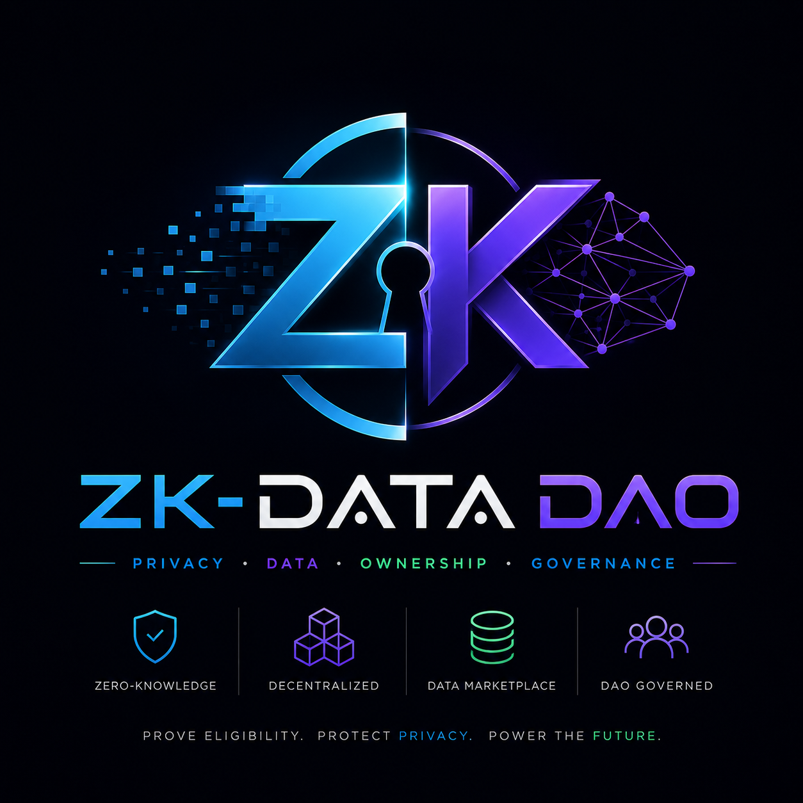

<p align="center">
  
</p>

# ⚡ ZK-DataDAO

> **Buy or Sell Data Without Compromising Your Privacy**

[](https://fvm.filecoin.io/)
[](https://soliditylang.org/)
[](https://reactjs.org/)
[](https://tableland.network/)
[](https://lighthouse.storage/)
[](LICENSE)

---

ZK-DataDAO is a **decentralized, privacy-preserving data marketplace** built on the Filecoin Virtual Machine (FVM). It enables the creation and management of DAOs specifically designed for collecting, contributing, and monetizing datasets — while ensuring contributors remain completely anonymous using **Zero-Knowledge Proofs (ZK-SNARKs)**.

DAO creators can implement contributor constraints and create a **Zero-Knowledge Barrier**. Users generate verifiable proofs using ZK-SNARK and prove they are eligible to participate in a DAO — without revealing any personal information.

## 📖 Documentation

For full interactive documentation with architecture diagrams, code examples, and step-by-step guides, open:

```
docs/index.html
```

Or read the phased documentation below.

---

## 📋 Table of Contents

- [Phase 1: Overview](#phase-1-overview)
- [Phase 2: Architecture](#phase-2-architecture)
- [Phase 3: Smart Contracts](#phase-3-smart-contracts)
- [Phase 4: ZKP System](#phase-4-zkp-system)
- [Phase 5: Frontend](#phase-5-frontend)
- [Phase 6: Data Layer](#phase-6-data-layer)
- [Phase 7: Setup & Deployment](#phase-7-setup--deployment)
- [Phase 8: API Reference](#phase-8-api-reference)
- [Known Issues](#known-issues)
- [Glossary](#glossary)

---

## Phase 1: Overview

### What is ZK-DataDAO?

ZK-DataDAO is a privacy-first data marketplace built on the **Filecoin Virtual Machine (FVM)**. It lets anyone:

- **Create a DAO** to collect specific types of data with eligibility requirements
- **Contribute data** by proving eligibility using zero-knowledge proofs (without revealing identity)
- **Earn FIL rewards** for valid data contributions
- **Store data permanently** on the Filecoin network via decentralized storage deals

### The Problem It Solves

| Problem | Solution |
|---|---|
| Traditional data markets expose contributor identity | ZK proofs allow proving eligibility without revealing who you are |
| No trustless way to verify eligibility criteria | ZK-SNARKs verify conditions cryptographically on-chain |
| Centralized storage is censorship-prone | Filecoin decentralized storage deals ensure data permanence |
| Manual reward distribution has middlemen | Smart contract reward pools auto-distribute to eligible contributors |

### Three-Actor Model

| Actor | Role | Key Actions |
|---|---|---|
| 🏭 **DAO Operator** | Creates and manages the DAO | Set eligibility rules, fund reward pool, define data format, release funds |
| 👤 **Data Contributor** | Proves eligibility and submits data | Generate ZK proof, join DAO, upload data to IPFS/Filecoin, earn FIL |
| 🌐 **Filecoin Network** | Trustless infrastructure | Store data, process transactions, run smart contracts |

### The ZK Innovation

The defining feature is the **Zero-Knowledge Barrier**:

> A contributor can prove *"I am a member of Discord server X"* without the smart contract ever learning their Discord username, email, or any personal data. Only a cryptographic proof goes on-chain.

### Project Structure

```
Zk-DataDao/
├── Client/                   # React frontend DApp
│   ├── src/
│   │   ├── App.js            # Root + wallet providers (wagmi, RainbowKit)
│   │   ├── Pages/            # Home, DAOs, Create, Profile
│   │   │   ├── Home.jsx      # Landing page
│   │   │   ├── DAOs.jsx      # DAO listing + Discord OAuth callback handler
│   │   │   ├── Create.jsx    # DAO creation form + contract deployment
│   │   │   └── Profile.jsx   # User/Operator dashboard switcher
│   │   ├── Components/       # Reusable UI components
│   │   │   ├── ZKdiscord.jsx # ZKP generation + joinDAO flow
│   │   │   ├── Card.jsx      # DAO info card + Discord OAuth link
│   │   │   ├── Userprofile.jsx    # Contributor dashboard
│   │   │   ├── Operatorporfile.jsx # Operator dashboard
│   │   │   ├── UploadFIle.jsx     # Lighthouse upload + Filecoin deal
│   │   │   ├── Loader.jsx    # Loading spinner
│   │   │   └── Navbar.jsx    # Navigation + ConnectButton
│   │   ├── Constants/
│   │   │   └── contract.js   # Contract ABIs and addresses (~700KB)
│   │   └── file_server/
│   │       └── index.js      # Minimal Express utility
│   ├── package.json          # Dependencies
│   └── .env                  # API keys (NEVER commit!)
│
├── ZKP/                      # Zero-Knowledge Proof artifacts
│   ├── server_verify.circom  # Circom 2.0 circuit definition
│   ├── server_verify.r1cs    # Compiled circuit constraints
│   ├── server_verify.wasm    # WebAssembly for witness computation
│   ├── circuit_final.zkey    # Final proving key (after ceremony)
│   ├── verification_key.json # Verifier key (used by verifier.sol)
│   ├── verifier.sol          # Auto-generated Groth16 on-chain verifier
│   ├── pot14_*.ptau          # Powers of Tau ceremony files (Phase 1)
│   ├── challenge_*/          # Phase 2 ceremony contribution files
│   ├── witness.wtns          # Example witness file
│   ├── generate_witness.js   # Witness computation script
│   └── witness_calculator.js # WASM-based witness calculator
│
├── smart_contracts/          # Solidity contracts + Hardhat
│   ├── contracts/
│   │   ├── DAO.sol           # Core DAO: members, rewards, contributions
│   │   ├── DealClient.sol    # Filecoin storage deal client
│   │   └── verifier.sol      # Groth16 ZKP on-chain verifier
│   ├── deploy/
│   │   └── 0_deploy.js       # Hardhat deployment script
│   ├── hardhat.config.js     # Network config (Hyperspace + Mainnet)
│   ├── helper-hardhat-config.js
│   └── package.json
│
└── docs/
    └── index.html            # Full interactive documentation site
```

---

## Phase 2: Architecture

### High-Level Architecture

```
┌─────────────────────────────────────────────────────────────────┐
│                       User's Browser                            │
│                                                                 │
│  ┌──────────────────────────────────────────────────────────┐  │
│  │               React DApp (Client/)                       │  │
│  │  wagmi · viem · RainbowKit · ZoKrates-JS · snarkjs       │  │
│  └──────────────────────────────────────────────────────────┘  │
└──────────────┬───────────────────────────────┬──────────────────┘
               │ JSON-RPC                       │ REST / OAuth
               ▼                               ▼
┌──────────────────────────┐    ┌─────────────────────────────────┐
│  Filecoin Hyperspace     │    │         External Services        │
│  (chainId: 3141)         │    │                                 │
│                          │    │  ┌───────────┐  ┌────────────┐  │
│  ┌────────────────────┐  │    │  │ Discord   │  │ Lighthouse │  │
│  │    DAO.sol         │  │    │  │ OAuth2 API│  │ IPFS/FIL   │  │
│  │ (per-DAO instances)│  │    │  └───────────┘  └────────────┘  │
│  └────────────────────┘  │    │                                 │
│  ┌────────────────────┐  │    │  ┌───────────────────────────┐  │
│  │  DealClient.sol    │  │    │  │  Tableland (On-chain SQL)  │  │
│  │  Filecoin Deals    │  │    │  │  daos_3141_162            │  │
│  └────────────────────┘  │    │  │  dao_data_3141_164        │  │
│  ┌────────────────────┐  │    │  └───────────────────────────┘  │
│  │   verifier.sol     │  │    └─────────────────────────────────┘
│  │   Groth16 ZKP      │  │
│  └────────────────────┘  │
└──────────────────────────┘
```

### Technology Stack

#### Frontend
| Technology | Version | Purpose |
|---|---|---|
| React | 18.2 | UI Framework |
| React Router | 6.11 | Client-side routing |
| wagmi | 1.0.5 | Filecoin wallet hooks & contract reads |
| viem | 0.3.30 | Low-level contract deployment |
| ethers.js | 5.7 | Tableland signing, wallet operations |
| RainbowKit | 1.0.0 | Wallet connection modal |
| ZoKrates JS | 1.1.8 | In-browser ZKP generation |
| snarkjs | 0.6.11 | Groth16 proof system |
| @tableland/sdk | 4.2.2 | Decentralized SQL database |
| @lighthouse-web3/sdk | 0.2.3 | IPFS/Filecoin uploads |
| discord-oauth2 | 2.11 | Discord guild verification |

#### Smart Contracts
| Technology | Version | Purpose |
|---|---|---|
| Solidity | ^0.8.17 | Smart contract language |
| Hardhat | latest | Development & deployment |
| @zondax/filecoin-solidity | latest | Filecoin built-in actor bindings |
| solidity-cborutils | latest | CBOR encoding for deals |

#### ZKP System
| Technology | Purpose |
|---|---|
| Circom 2.0 | ZK circuit definition |
| snarkjs | Groth16 proof toolchain |
| Powers of Tau (pot14) | Phase 1 universal trusted setup |
| ZoKrates | In-browser ZKP for Discord verification |
| bn128 curve | Elliptic curve for Groth16 pairing |

---

## Phase 3: Smart Contracts

### `DAO.sol` — Core DAO Contract

Each DAO is an **independently deployed instance** of this contract.

```solidity
// SPDX-License-Identifier: MIT
pragma solidity ^0.8.0;

contract DAO {
    address[] public members;       // all joined contributors
    address public owner;           // DAO creator / operator
    uint256 public rewardAmount;    // total reward pool (wei)
    uint capacity;                  // max number of members

    // Deploys DAO and locks reward funds in the contract
    constructor(uint256 _rewardAmount, uint _capacity) payable {
        require(msg.value == _rewardAmount);
        owner = msg.sender;
        rewardAmount = _rewardAmount;
        capacity = _capacity;
    }

    // Called by contributor after ZKP verification passes
    function joinDAO() external {
        require(members.length < capacity, "DAO is full");
        members.push(msg.sender);
    }

    // Operator distributes reward equally among eligible members
    function sendReward(address payable[] memory eligibleMembers) external payable {
        require(msg.sender == owner, "Only owner can disburse rewards");
        uint amount = rewardAmount / eligibleMembers.length;
        for (uint i = 0; i < eligibleMembers.length; i++) {
            eligibleMembers[i].transfer(amount);
        }
    }
}
```

**Key Design:** The contract is minimal by design. ZKP eligibility checking happens off-chain in the browser; the proof authorizes the user to call `joinDAO()`.

### `DealClient.sol` — Filecoin Storage Deal Client

Interfaces with Filecoin's **built-in Market Actor (f05)** using CBOR encoding. Creates and manages storage deals for data contributed by users.

**Deal Status Lifecycle:**
```
None → RequestSubmitted → DealPublished → DealActivated → DealTerminated
```

**Key Functions:**
- `makeDealProposal(DealRequest)` — Creates storage deal proposal (owner only)
- `handle_filecoin_method(method, codec, params)` — Universal FRC42 callback entry point
- `updateActivationStatus(pieceCid)` — Poll to update deal status
- `addBalance/withdrawBalance` — Manage FIL escrow

**FRC42 Method Numbers:**
- `AUTHENTICATE_MESSAGE_METHOD_NUM = 2643134072`
- `MARKET_NOTIFY_DEAL_METHOD_NUM = 4186741094`
- `DATACAP_RECEIVER_HOOK_METHOD_NUM = 3726118371`

### `verifier.sol` — ZKP On-Chain Verifier

Auto-generated by `snarkjs` from the Circom circuit. Implements **Groth16 verification** using BN128 elliptic curve pairing.

```solidity
function verifyProof(
    uint[2] memory a,      // Proof point A (G1)
    uint[2][2] memory b,   // Proof point B (G2)
    uint[2] memory c,      // Proof point C (G1)
    uint[1] memory input   // Public inputs
) public view returns (bool r)
```

---

## Phase 4: ZKP System

### What is a ZK-SNARK?

A **Zero-Knowledge Succinct Non-Interactive Argument of Knowledge** allows a prover to convince a verifier they know a secret value satisfying some constraint — without revealing the secret.

### The Circom Circuit

```circom
pragma circom 2.0.0;

template server_verify() {
   signal input in;    // Private: user's actual eligibility value
   signal output req;  // Public output
   req <== in;         // Constraint: pass through
}
component main = server_verify();
```

### ZoKrates Circuit (In-Browser for Discord)

```
// Proves: private 'a' equals public 'b'
// Without revealing what 'a' is
def main(private field a, field b) {
    assert(a == b);
    return;
}
// a = 1 (IS in required Discord server) or 0 (NOT in server) [PRIVATE]
// b = 1 (DAO requirement: must be a member)                   [PUBLIC]
```

### Proof Generation Flow

```
1. Discord OAuth → user authorizes 'guilds' scope
2. Fetch /api/users/@me/guilds → check if required server is in list
3. Set user = 1 (in server) or 0 (not in server)
4. ZoKrates compiles circuit in browser
5. Compute witness: (private: user_value, public: requirement=1)
6. Generate Groth16 proof: (A, B, C) elliptic curve points
7. Local verification → if user ≠ req, proof throws (cannot fake!)
8. If verified ✅ → joinDAO() called on-chain
```

### Trusted Setup Files (ZKP/)

| File | Phase | Description |
|---|---|---|
| `pot14_0000.ptau` | Phase 1 Start | Initial Powers of Tau (universal) |
| `pot14_0001–0003.ptau` | Phase 1 Contributions | Entropy contributions |
| `pot14_final.ptau` | Phase 1 Complete | ~18MB, supports 2^14 constraints |
| `circuit_0000–0003.zkey` | Phase 2 | Circuit-specific setup contributions |
| `circuit_final.zkey` | Phase 2 Complete | Final proving key |
| `verification_key.json` | Output | Verifier key for verifier.sol |

---

## Phase 5: Frontend

### Routes

| Path | Component | Purpose |
|---|---|---|
| `/` | Home.jsx | Landing page |
| `/daos` | DAOs.jsx | Browse DAOs or handle Discord OAuth callback |
| `/createDao` | Create.jsx | DAO creation form (operators) |
| `/profile` | Profile.jsx | User/Operator dashboard |

### User Flow 1 — DAO Creation

```
Connect Wallet → Fill Parameters (name, capacity, min commits, reward TFIL)
    → Upload Format Requirements → Lighthouse → IPFS CID → Filecoin Deal
    → Select ZKP Constraint (Discord server, Age, None)
    → Deploy DAO.sol contract on Filecoin Hyperspace
    → Insert into Tableland daos_3141_162 table
    → DAO live at /daos ✅
```

### User Flow 2 — Joining a DAO (Discord ZKP)

```
Browse /daos → Click "Verify Joining Condition"
    → Discord OAuth2 redirect (guilds scope)
    → Callback to /daos?dao=<index>#access_token=<token>
    → GET /api/users/@me/guilds with token
    → Check if required server in guild list
    → Generate ZoKrates proof in browser
    → If verified: call DAO.joinDAO() on-chain
    → Insert into Tableland dao_data_3141_164 ✅
```

### User Flow 3 — Data Contribution

```
/profile → "User" tab → See joined DAOs from Tableland
    → Check commits (DAO.getContribution(address))
    → "Commit Data" → Upload file via Lighthouse → IPFS CID
    → DealClient.makeDealProposal() → Filecoin storage deal
    → DAO.contribute(cid) with 0.1 TFIL fee ✅
```

### User Flow 4 — Reward Distribution (Operator)

```
/profile → "DAO Operator" tab → See created DAOs from Tableland
    → "Release Funds to Valid Contributors"
    → DAO.sendReward(eligibleMembers[]) → FIL distributed ✅
```

### ZKP Constraint Options

| Option | Status | Notes |
|---|---|---|
| None | ✅ Working | No constraint applied |
| Age restriction | ⚙️ Partial | UI only, circuit not implemented |
| Discord Server | ✅ Full | Complete OAuth2 + ZoKrates proof flow |
| Twitter/Social | ❌ Not ready | "Feature not available yet" |

---

## Phase 6: Data Layer

### Tableland Tables

**Table 1: `daos_3141_162` — DAO Registry**

```sql
CREATE TABLE daos (
  contract_add     text primary key,  -- deployed DAO contract address
  creator          text,              -- operator wallet address
  name             text,              -- DAO name
  min_commits      integer,           -- min contributions for rewards
  capacity         integer,           -- max members
  contributors     integer,           -- current contributor count
  zkContraint_type text,              -- "Discord" | "Age" | "none"
  zkContraint      text,              -- constraint value (e.g. server name)
  FormatReq_cid    text,              -- IPFS CID of requirements doc
  Reward           integer            -- reward in TFIL
);
```

**Table 2: `dao_data_3141_164` — Contributor Activity**

```sql
CREATE TABLE dao_data (
  id            integer primary key,
  user_add      text,     -- contributor wallet address
  dao_add       text,     -- DAO contract address
  contributions integer   -- number of data submissions (starts at 0)
);
```

### Storage Architecture

| Data Type | Storage | Access |
|---|---|---|
| Format requirement docs | IPFS via Lighthouse | `https://gateway.lighthouse.storage/ipfs/<CID>` |
| Contributor data | IPFS + Filecoin deal | `https://gateway.lighthouse.storage/ipfs/<CID>` |
| Filecoin deal metadata | DealClient.sol | `DealClient.getDealByIndex(index)` |
| DAO metadata + activity | Tableland | Tableland SDK SQL queries |

---

## Phase 7: Setup & Deployment

### Prerequisites

| Tool | Version | Purpose |
|---|---|---|
| Node.js | ≥ 16.x | JavaScript runtime |
| Yarn | ≥ 1.22 | Package manager |
| MetaMask | Latest | EVM wallet for Filecoin Hyperspace |
| Filecoin Hyperspace tFIL | — | Test tokens (get from faucet) |
| Lighthouse API Key | — | IPFS file uploads |
| Discord Application | — | OAuth2 for ZK verification |

### Step 1: Clone & Install

```bash
# Clone repository
git clone <repo-url> Zk-DataDao
cd Zk-DataDao

# Install frontend dependencies
cd Client
yarn install

# Install smart contract dependencies
cd ../smart_contracts
yarn install
```

### Step 2: Configure Environment Variables

Create `Client/.env`:
```env
REACT_APP_PK=0xYOUR_PRIVATE_KEY_HERE        # For Tableland signed writes
REACT_APP_LHAPI=your_lighthouse_api_key     # For IPFS uploads
```

Create `smart_contracts/.env`:
```env
PRIVATE_KEY=0xYOUR_DEPLOYER_PRIVATE_KEY
```

> ⚠️ **Never commit `.env` files!** Never expose private keys in production JS bundles. Use a dedicated low-balance hot wallet for development.

### Step 3: Add Filecoin Hyperspace to Wallet

```
Network Name:    Filecoin Hyperspace Testnet
RPC URL:         https://api.hyperspace.node.glif.io/rpc/v1
Chain ID:        3141
Currency Symbol: tFIL
Block Explorer:  https://hyperspace.filfox.info/en
```

Get free test tFIL: https://hyperspace.yoga/#faucet

### Step 4: Deploy Smart Contracts

```bash
cd smart_contracts

# Uncomment deployment lines in deploy/0_deploy.js first, then:
npx hardhat deploy --network Hyperspace

# Deploy to mainnet:
npx hardhat deploy --network FilecoinMainnet
```

### Step 5: Update Contract References

After deploying, update `Client/src/Constants/contract.js` with the new contract addresses and ABIs from `smart_contracts/artifacts/`.

### Step 6: Run the Frontend

```bash
cd Client
yarn start
# App runs at http://localhost:3000
# Make sure wallet is on Filecoin Hyperspace (chainId 3141)
```

### Step 7: Discord App Setup

1. Go to https://discord.com/developers/applications → New Application
2. OAuth2 → Redirects → Add `http://localhost:3000/daos`
3. Replace Client ID `1109245990302662787` in `Card.jsx` OAuth URL with yours

### Regenerating ZKP Artifacts (Optional)

```bash
npm install -g snarkjs circom
cd ZKP

# Compile circuit
circom server_verify.circom --r1cs --wasm --sym

# Phase 2 setup (reuses existing pot14_final.ptau)
snarkjs groth16 setup server_verify.r1cs pot14_final.ptau circuit_0000.zkey
snarkjs zkey contribute circuit_0000.zkey circuit_final.zkey
snarkjs zkey export verificationkey circuit_final.zkey verification_key.json
snarkjs zkey export solidityverifier circuit_final.zkey verifier.sol

# Test proof generation
node generate_witness.js server_verify.wasm input.json witness.wtns
snarkjs groth16 prove circuit_final.zkey witness.wtns proof.json public.json
snarkjs groth16 verify verification_key.json public.json proof.json
```

### Network Configuration

```javascript
// hardhat.config.js
networks: {
    Hyperspace: {          // Testnet
        chainId: 3141,
        url: "https://api.hyperspace.node.glif.io/rpc/v1",
        accounts: [PRIVATE_KEY],
    },
    FilecoinMainnet: {     // Production
        chainId: 314,
        url: "https://api.node.glif.io",
        accounts: [PRIVATE_KEY],
    },
}
```

---

## Phase 8: API Reference

### DAO.sol — Public Interface

| Function | Visibility | Inputs | Returns | Notes |
|---|---|---|---|---|
| `constructor` | payable | rewardAmount, capacity | — | msg.value must = rewardAmount |
| `joinDAO()` | external | — | — | Adds msg.sender to members |
| `sendReward(address[])` | external payable | eligibleMembers[] | — | Owner only |
| `members(uint)` | public view | index | address | Auto-generated getter |
| `rewardAmount()` | public view | — | uint256 | Total reward pool |
| `owner()` | public view | — | address | DAO creator |

### DealClient.sol — Public Interface

| Function | Visibility | Returns | Notes |
|---|---|---|---|
| `makeDealProposal(DealRequest)` | public | bytes32 | Owner only, returns request ID |
| `getDealByIndex(uint256)` | public view | DealRequest | Read deal by index |
| `updateActivationStatus(bytes)` | public | — | Poll deal status |
| `addBalance(uint256)` | public | — | Owner only, fund escrow |
| `handle_filecoin_method(...)` | public | tuple | FRC42 callback entry point |
| `dealsLength()` | public view | uint256 | Total deal count |
| `pieceStatus(bytes)` | public view | Status | Status of a piece CID |

### DealRequest Struct

```solidity
struct DealRequest {
  bytes    piece_cid;                // CID as hex bytes (0x prefixed)
  uint64   piece_size;               // File size in bytes
  bool     verified_deal;            // Use DataCap (true/false)
  string   label;                    // Human-readable label (IPFS CID string)
  int64    start_epoch;              // Filecoin epoch to start storage
  int64    end_epoch;                // Filecoin epoch to end storage
  uint256  storage_price_per_epoch;  // Price per epoch (0 = free)
  uint256  provider_collateral;      // Provider collateral
  uint256  client_collateral;        // Client collateral
  uint64   extra_params_version;     // Must be 1
  ExtraParamsV1 extra_params;        // Additional parameters
}
```

### Common Tableland Queries

```javascript
const db = new Database({ signer });

// Read all DAOs
const { results } = await db.prepare(`SELECT * FROM daos_3141_162;`).all();

// Contributor's joined DAOs
const { results } = await db
  .prepare(`SELECT * FROM dao_data_3141_164 WHERE user_add="${address}";`)
  .all();

// Operator's created DAOs
const { results } = await db
  .prepare(`SELECT * FROM daos_3141_162 WHERE creator="${address}";`)
  .all();

// Insert DAO after deployment
await db
  .prepare(`INSERT INTO daos_3141_162
    (contract_add, creator, name, min_commits, capacity,
     zkContraint_type, zkContraint, FormatReq_cid, Reward)
    VALUES (?,?,?,?,?,?,?,?,?);`)
  .bind(contractAddr, address, name, minCommits, capacity, zkType, zkValue, cid, reward)
  .run();
```

### External APIs

| API | Endpoint | Auth | Purpose |
|---|---|---|---|
| Discord OAuth | `/oauth2/authorize?scope=guilds` | — | Initiate OAuth2 flow |
| Discord | `GET /api/users/@me/guilds` | Bearer token | Fetch guild memberships |
| Lighthouse SDK | `lighthouse.upload(event, apiKey)` | API Key | Upload files to IPFS |
| Filecoin RPC | `https://api.hyperspace.node.glif.io/rpc/v1` | — | Read/write blockchain state |

---

## Known Issues

> ⚠️ **This is a hackathon prototype.** The architecture is solid but these issues need fixing before production.

| # | Issue | Location | Severity |
|---|---|---|---|
| 1 | **ZKP proof not submitted on-chain** — `joinDAO()` callable by anyone | ZKdiscord.jsx | 🔴 Critical |
| 2 | **Private key in frontend** — `REACT_APP_PK` exposed in browser bundle | ZKdiscord.jsx | 🔴 Critical |
| 3 | **Missing contract functions** — `getContribution()` and `totalContributors()` called by UI but absent from DAO.sol | DAO.sol | 🟠 High |
| 4 | **Hardcoded reward recipient** — operator panel uses one hardcoded address | Operatorporfile.jsx | 🟠 High |
| 5 | **Localhost in OAuth URL** — Discord redirect hardcoded to localhost:3000 | Card.jsx | 🟡 Medium |
| 6 | **No data format validation** — any CID accepted without checking format | DAO.sol | 🟡 Medium |
| 7 | **Tableland db without signer** — INSERT calls fail in Create.jsx | Create.jsx | 🟡 Medium |
| 8 | **Age & Social ZKP unimplemented** — UI exists, circuits missing | Create.jsx | 🟢 Low |

### Recommended Fixes

1. **Connect ZKP to on-chain gate** — Format proof from ZoKrates and call `verifier.sol#verifyProof()` on-chain. Smart contract should require verifier result before `joinDAO()`.
2. **Move signer server-side** — Replace `REACT_APP_PK` with a backend API that signs Tableland writes.
3. **Add missing DAO.sol functions** — Add `getContribution(address) → uint256` and `totalContributors() → uint256`.
4. **Dynamic eligible member resolution** — Query Tableland for contributors meeting `min_commits`, pass to `sendReward()`.

---

## Glossary

| Term | Definition |
|---|---|
| **ZK-SNARK** | Zero-Knowledge Succinct Non-Interactive Argument of Knowledge |
| **Groth16** | ZK-SNARK proving system with constant-size proofs and fast on-chain verification |
| **Circom** | Domain-specific language for defining arithmetic circuits for ZK proofs |
| **ZoKrates** | High-level ZKP toolbox with DSL. Used in-browser for Discord verification |
| **Witness** | Assignment of values to all circuit signals — the complete solution to constraints |
| **Trusted Setup** | One-time ceremony generating proving/verification keys for a ZKP system |
| **Powers of Tau** | Universal trusted setup ceremony reusable across circuits |
| **DAO** | Decentralized Autonomous Organization — here, each is a separate deployed contract |
| **Filecoin FVM** | Filecoin Virtual Machine — EVM-compatible execution on the Filecoin network |
| **Tableland** | Decentralized SQL database protocol built on EVM chains |
| **CID** | Content Identifier — cryptographic hash used by IPFS to identify content |
| **CAR file** | Content Addressable aRchive — format for packaging IPFS data for Filecoin deals |
| **Piece CID / commP** | Filecoin-specific identifier computed from a CAR file for storage deals |
| **Market Actor (f05)** | Filecoin's built-in actor managing storage deals |
| **CBOR** | Concise Binary Object Representation — Filecoin's serialization format |
| **FRC42** | Filecoin method dispatch protocol for EVM actors receiving actor messages |
| **bn128** | BN elliptic curve (also BN254/alt_bn128) used for Groth16 pairing |
| **wagmi** | React hooks library for EVM wallet connection and contract interaction |
| **viem** | TypeScript interface for Ethereum — used for contract deployment |
| **tFIL** | Test FIL — native gas token for Filecoin Hyperspace testnet |

---

## License

MIT License — see [LICENSE](LICENSE) for details.

---

## Available Scripts

### Client (Frontend)

```bash
cd Client

yarn start     # Run development server at localhost:3000
yarn build     # Build for production
yarn test      # Run tests
```

### Smart Contracts

```bash
cd smart_contracts

npx hardhat help                          # Show all tasks
npx hardhat test                          # Run contract tests
REPORT_GAS=true npx hardhat test          # Run tests with gas report
npx hardhat node                          # Start local Hardhat node
npx hardhat deploy --network Hyperspace   # Deploy to Filecoin Hyperspace
```

---

*Built with ❤️ on Filecoin FVM · Privacy-first data markets powered by ZK-SNARKs*
